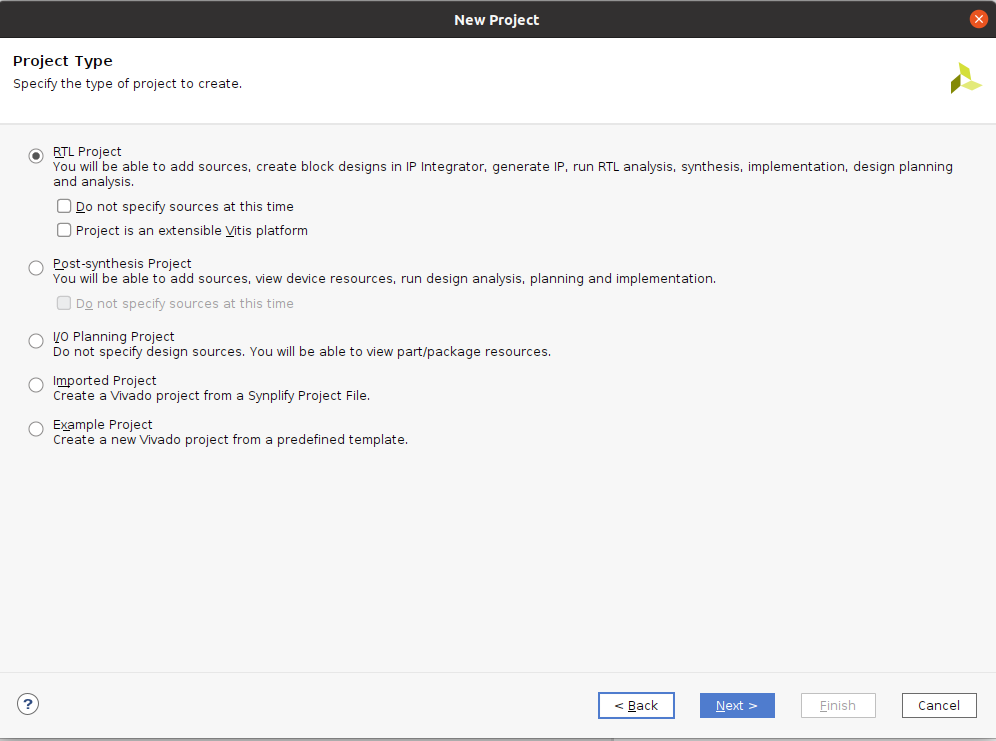
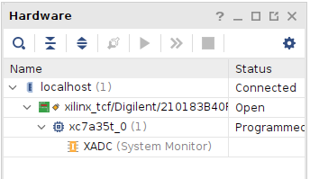
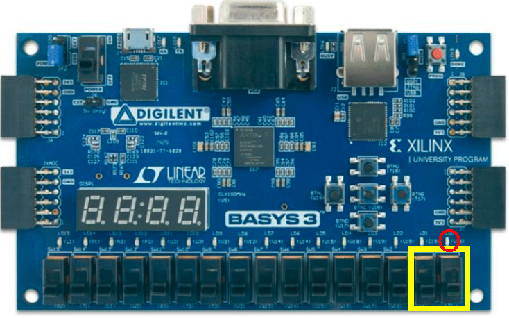

# COL215 – Digital Logic and System Design

## Lab Assignment 1

### 1 Launching and creating a project in Vivado

1. To launch Vivado, double click the `vivado` icon on the desktop.
2. When the tool opens, click on **Create New project** and click **Next**.
3. Select the project directory and name.
4. In the next dialog box, select **RTL project**.



5. Create a new file named `AND_gate`. Select the file type as verilog. Ensure that Target and simulator language is verilog.
6. In the next dialog window for adding constraints, add the provided `basys3.xdc` file using "Add Files".
7. Select part number `xc7a35tcpg236-1` and click next. After this the project creation is done.

### 1.1 Adding the AND Gate Code

8. Under **design source**, double click `AND_gate` file to open it in the editor and add the following code for the basic AND gate.

9. Functionality and implementation for `AND_gate` is given below:

| a | b | a AND b |
|---|---|---------|
| 0 | 0 | 0       |
| 0 | 1 | 0       |
| 1 | 0 | 0       |
| 1 | 1 | 1       |

```verilog
// AND GATE
module AND_gate (
    input a,
    input b,
    output c);
    
    assign c = a & b;
    
endmodule
```

### 1.2 Simulation of the Design

10. **Simulation of the design**: Now to simulate your design you need to make a test bench and test your code.

Test Benches are used to test the correctness of the Design Under Test (DUT). They can be used to provide inputs to the design and observe the outputs. As a start, you can force the values of the inputs and observe their output in the waveform.

A sample testbench is given for simulation of AND gate. You need to create a simulation source file for the test bench.

**Note**: Test Bench is only for simulation. Please do not run the Synthesis/implementation flow on it, as introduced in the next steps.

```verilog
// AND_gate_tb.v (testbench)
module AND_gate_tb ();
    // In this TB modeling Style, the test bench instantiates the DUT as a component
    // and passes the inputs from a separate verilog module at instantiation
    reg a, b; // a, b are storage elements
    wire c; // c is the output
    
    // connecting testbench signals with AND_gate
    AND_gate UUT (
        .a (a),
        .b (b),
        .c (c)
    );
    
    initial begin
        // inputs
        // 00 at 0 ns
        a = 0;
        b = 0;
        
        // 01 at 20 ns, as b is 0 at 20 ns and a is changed to 1 at 20 ns
        #20 a = 1;
        
        // 10 at 40 ns
        #20 b = 0; a = 0;
        
        // 11 at 60 ns
        #20 a = 1; b = 1;
    end
    
endmodule
```

### 1.3 Constraints and Synthesis

11. Next under the **Constraints section**, edit the `basys3.xdc` file to connect the switches and LED to the declared port. In this module, switches V17 and V16 act as inputs to the gate and LED U16 as the output of the gate.

```
set_property PACKAGE_PIN V17 [get_ports {a}]
set_property IOSTANDARD LVCMOS33 [get_ports {a}]

set_property PACKAGE_PIN V16 [get_ports {b}]
set_property IOSTANDARD LVCMOS33 [get_ports {b}]

....
....
....

set_property PACKAGE_PIN U16 [get_ports {c}]
set_property IOSTANDARD LVCMOS33 [get_ports {c}]

....
....
```

12. Under the **Flow Navigator**, Click on **Run synthesis** then **Run implementation**. Please open the synthesized design to analyze the generated output. Look at the resource utilization. Observe the number of LUTs used in your design. 

**Open Synthesized Design => Report utilization**

**Additional info**: Number of jobs can be increased depending upon the available cores. This may improve the running time. For now, use the default value given in the dialog box.

13. After this click on **Generate Bitstream**.

### 1.4 Hardware Programming

14. Once this is done, click on **Open Hardware Manager** => **Open Target** => **Auto Connect**. Ensure that basys3 board is connected to the system via micro-USB cable.



15. Click on **Program Device**. Make sure the correct bit file is selected.

16. Once the process is complete, toggle the bottom right corner switches (V16 and V17, the AND gate inputs). This should change the LED (LD0/U16) according to the AND gate logic.



17. After completing the simulation and testing of AND gate, the next task is to realize a two input **OR** and single input **NOT** gate using the same template. Map different Switches on the board for OR and NOT gate. All three gates should be running using different switches on the basys 3 board.

---

