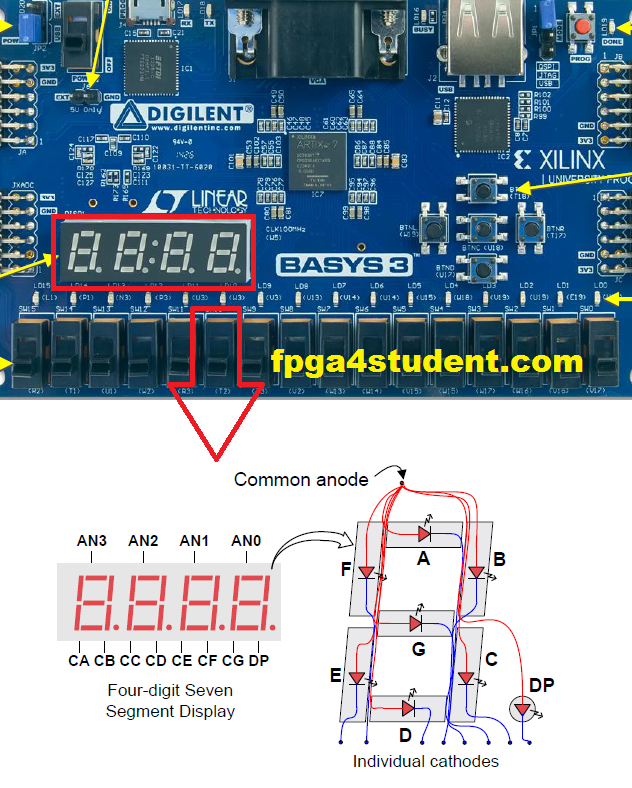

# COL215 – Digital Logic and System Design

**Lab Assignment 2: 7-Segment Display**

---

## 1. Introduction

Design and implement a circuit that takes as input the switches SW0-SW9 in the
Basys3 board and displays the corresponding decimal digit 0–9 on one of the four
7-segment displays on the board. For example, if SW9 is turned ON (and switches
SW0–SW8 turned OFF), then the digit 9 should appear on the display. Full table below.

### Switch-to-Digit Mapping

| Slider Switch | Digit to Display |
|---------------|------------------|
| SW9           | 9                |
| SW8           | 8                |
| SW7           | 7                |
| SW6           | 6                |
| SW5           | 5                |
| SW4           | 4                |
| SW3           | 3                |
| SW2           | 2                |
| SW1           | 1                |
| SW0           | 0                |

---

## 2. Problem Description

The assignment requires you to design the following:

Specify in Verilog and implement circuit for which the inputs are
the 10 switches (SW0-SW9) indicating the given decimal number and the outputs
correspond to the 7 cathode pins. Map the cathode and anode pins in the Basys3
constraint file. For the exact name of the pins, refer to the Basys 3 reference
manual Section 8.1 Seven-Segment Display.

### Requirements

- **Use only one 7-segment display unit:** the LSB display, as shown in Figure 1
- **Inputs:** 10 switches for 0..9
- **Outputs:** 7 bits for 7-segment display
- **Function:** Output decimal digit 0..9 corresponding to switch position
- **Implementation:** Write only behavioural Verilog code with IF/CASE statements

### Priority Note

In case if two switches are both turned ON (e.g., SW9 and SW7), the priority
should be given to the one corresponding to the larger digit (i.e., 9 in this
case). In such a case, digit 9 should be displayed. Your IF/CASE construct
should take care of this prioritization. If none of the switches is ON, nothing
should be displayed.

---

## 2.1 Seven Segment Decoder

Figure 2 shows the pin-out details for the display unit. It has 7 cathode pins,
1 anode pin (connected to all 7 LEDs) and 1 pin for decimal point. To switch
an LED on, the anode should be driven HIGH and the cathode LOW. In general, the
LED display is activated via driving anode HIGH and the corresponding digit via
varying cathode signals.

Now, if the SW0 is ON, then all the LEDs except G should be switched ON.
Similarly, if SW3 is ON, then LEDs F and E should be OFF, and the rest should
be ON.

**Figure 2:** Pin details for 7 seven display on Basys 3 board

### Important Note

The on Basys 3 board anode/cathode are **ACTIVE LOW** pins (i.e., 0 = ACTIVE, 1 = INACTIVE).

For details, refer to the Basys 3 reference manual Section 8.1 Seven-Segment Display.

---

## 3. Resources References

- **IEEE Document:** https://ieeexplore.ieee.org/document/1620780
- **Basys 3 Board Reference Manual:** https://digilent.com/reference/_media/basys3:basys3_rm.pdf
- **Online Verilog Simulator:** https://www.edaplayground.com

